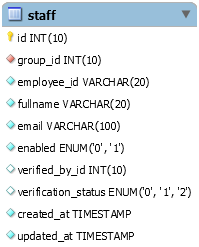
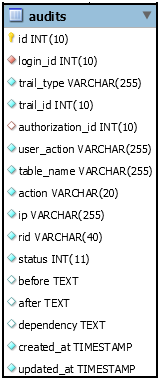

# Lauditor

Lauditor is a laravel based auditing and authorization package, which helps you control your manage tasks, permissions and user groups. It is designed to manage all application tasks and user permission by utilization laravel's routes.

[](https://packagist.org/packages/ndexondeck/lauditor)

## Table of Contents

1. [How](#how)
    1. [Publish Vendor Files](#publish-vendor-files)
    1. [Auditing](#auditing)
    1. [Authorization](#authorization)
    1. [User Models](#user-models)
    1. [Generating Tasks](#generating-tasks)
    1. [Flushing Your Database](#flushing-your-database)
    1. [Request and Response for APPLICATION API](#request-and-response-for-application-api)

## How?

**Install with Composer:**

```
composer require ndexondeck/lauditor
```

### Publish Vendor Files

Lauditor comes with predefined controllers and models to fast-track your development, but you may already have something in place that you are never going to replace.
Then you may not want to publish all the files, so running the vendor:publish with minimal would be a better option, this ensures you only publish the necessary files.

To publish all files
```
php artisan vendor:publish --tag=ndexondeck-lauditor-all
```

Some others would prefer:
```
php artisan vendor:publish --tag=ndexondeck-lauditor-minimal
```

***Note: If you would'nt be using the default controllers or models provided by this package. For instance, Login model will be published because it is the default Audit user model. Please take a look at [User Models](#user-models) before running your migrations***


After this please uncomment the name spaces in the following files

app/Ndexondeck/Lauditor/Util.php
```
//namespace App\Ndexondeck\Lauditor;
```
TO
```
namespace App\Ndexondeck\Lauditor;
```

Similar, do the same for the following if published
1) app/BaseModel.php
1) app/Group.php
1) app/Login.php
1) app/Module.php
1) app/Permission.php
1) app/PermissionAuthorizer.php
1) app/Staff.php
1) app/Task.php

=> Note that all these models will be copied from the library, to you app folder, you can do away with or modify then where necessary

=> Furthermore, there are certain methods in the Util class that needs to be updated


### Auditing

```php
Use Ndexondeck\Lauditor\Model\Audit;

class YourAuditModel extends Audit {

}
```

### Authorization

```php
Use Ndexondeck\Lauditor\Model\Authorization;

class YourAuthorizedModel extends Authorization {

}
```

### User Models

This is the default user model configuration for auditing and authorization, you can change it if you user models are different
```php
'audit_user'=> [
        'column' => 'login_id',
        'model' => 'Login',
        'table' => 'logins',
    ],
'authorization_user'=> [
        'column' => 'staff_id',
        'model' => 'Staff',
        'table' => 'staff',
    ],
```

Any model that will be used for audit user must implement the AuditUser interface
```php
use Ndexondeck\Lauditor\Contracts\AuditUser;

class Login implements AuditUser{

}
```
So if your config for audit user is like
```php
'audit_user'=> [
        'column' => 'user_id',
        'model' => 'User',
        'table' => 'users',
    ],
```
Then the User model must implement AuditUser as shown below
```php
use Ndexondeck\Lauditor\Contracts\AuditUser;

class User implements AuditUser{

}
```


Similarly, model that will be used for authorization user must implement the AuthorizationUser interface
```php
use Ndexondeck\Lauditor\Contracts\AuthorizationUser;

class Staff implements AuthorizationUser{

}
```
Also, if the same User model is to be used as authorization_user as shown in the config below
```php
'authorization_user'=> [
        'column' => 'user_id',
        'model' => 'User',
        'table' => 'users',
    ],
```
Then the User model must also implement AuthorizationUser as shown below
```php
use Ndexondeck\Lauditor\Contracts\AuditUser;
use Ndexondeck\Lauditor\Contracts\AuthorizationUser;

class User implements AuditUser,AuthorizationUser{

}
```

### Generating Tasks

This feature works with your routes, where unique route naming is ensured

`php artisan task:generate`

### Flushing Your Database

This feature can help you flush your database, even multiple database simultaneously. See help for more

`php artisan db:flush`

### Request and Response for APPLICATION API

If you would like to document additional information like the request and response of all your API's, you can add "\Ndexondeck\Lauditor\Middleware\LogAfterRequest::class" the Http/Kernel.php file
as shown below.

```php
    //...

    /**
     * The application's global HTTP middleware stack.
     *
     * These middleware are run during every request to your application.
     *
     * @var array
     */
    protected $middleware = [
        \Illuminate\Foundation\Http\Middleware\CheckForMaintenanceMode::class,
        \Illuminate\Foundation\Http\Middleware\ValidatePostSize::class,
        \App\Http\Middleware\TrimStrings::class,
        \Illuminate\Foundation\Http\Middleware\ConvertEmptyStringsToNull::class,
        \App\Http\Middleware\TrustProxies::class,
        \Ndexondeck\Lauditor\Middleware\LogAfterRequest::class
    ];
    
    //...
```


## Audits (How it Works)

- The audit trail approach is a background process, which occurs at a Model level, any change to a model can be detected and then audited if the model is a child of Audit model.

Consider this: We want to keep audit trails of Staff Model below.



```php
Class Staff extends Audit{

    function boot(){
        parent::boot();
    }
}
```
The Audit model binds the creating, updating and deleting event listeners to the Staff model, through which audit trails can be captured.


```
●	id - primary key
●	login_id - the Login id of the logged in user foreign key
●	trail_type - the base class name of the trailed model e.g App\Staff
●	traild_id - the id of the record in the trailed table
●	authorization_id - present when a trail was authorized before committing
●	user_action - a customizable name given to the user’s action that led to the trail
●	table_name - the name of the trailed table
●	action - the database action taken on the trail (create, update or delete)
●	ip - the IP address of the user who initiated this action
●	rid - the request identification hash aka the commit id
●	status - determines the type and state of an audit
    ○	0 - An audit in revoked state
    ○	1 - An audit in active state
    ○	2 - An audit log i.e logs of audit events
    ○	3 - An audit awaiting authorization (pending trail)
●	before - a json value that keeps the trail’s state before an action
●	after - a json value that keeps the trail’s state after an action
●	dependency - present when a set of pending audit trails depends on the execution results of its predecessor when authorized
    e,g suppose we have the following trails waiting authorization in the following order. Create Staff, Create Login
    the Login->staff_id property may depend on the of the Staff->id
    Login::setDependency([
        ‘staff_id’ => ‘staff.id’ 
    ]);
    The method above will Add a dependency for the Create Login trail, to indicate that Login->staff_id will be derived from Staff->id
●	created_at - this will indicate the time the audit record was created.
●	updated_at - this will indicate when there was a last status change to an audit.
```

- Now lets get to see the available methods

...still loading

...meanwhile thanks to Adekunle Adekoya (Crystoline) for Helping out with testing